# Developer Guide
## Table of contents
## 1. Design

## 1.1 Overview of architecture
__Architecture Diagram__


There are 5 distinct features that exists within the FinanceIt application, all of which are accessed via the main menu 
interface facilitated in FinanceIt.java.

The design of the software can be split into 5 distinct components:
* Logic Manager component
* Logic component
* Input Manager component
* Data component
* Storage component

### 1.2 Logic Manager component

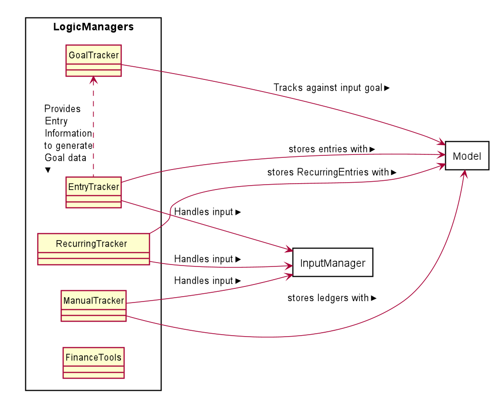

__Description__

The Logic Manager component serves as the bridge between user interface and program operations.
It includes 4 classes: 
* ```ManualTracker```
* ```EntryTracker```
* ```RecurringTracker```
* ```GoalTracker```
* ```FinanceTools```

__API__
* ```ManualTracker``` and ```EntryTracker``` maintains an instance of a ```DataList``` (```LedgerList``` and ```EntryList```) in ```Model``` respectively, 
 and provides an interface for the user can append, remove or perform other ```Data``` operations with the contents of the ```Datalist```.
* ```GoalTracker``` maintains a list of income or expense ```Goals``` to track against entries in the ```EntryList```, 
and provides an interface for the user to append or remove ```Goals```.
* ```Finance Tools``` class provides an interface for users to utilize an array of 
finance calculator tools within it.
* All ```Handler``` classes use the ```InputManager``` component to process user input, then use ```Logic``` component
to perform the operation associated with the user input.

### 1.3 Logic component

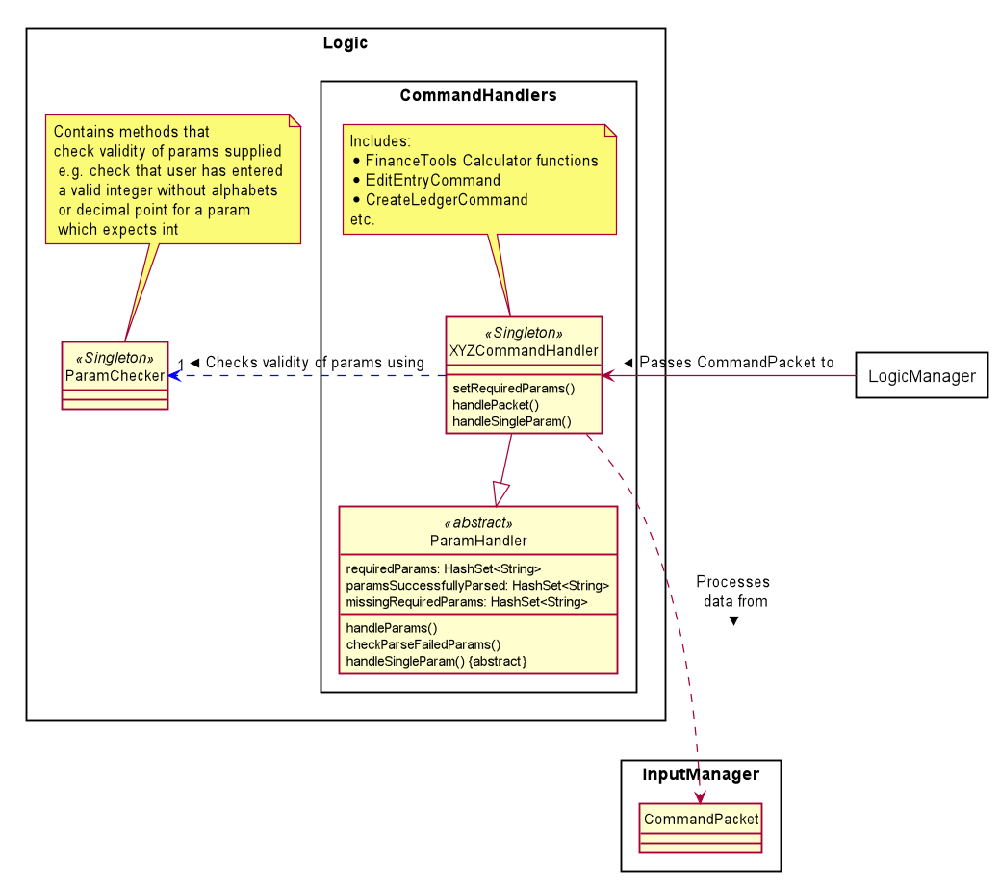

__Description__


__API__


### 1.4 Input Manager component


__Description__

The Input Manager consists of the ```UiManager``` class, and the ```Parser``` sub-component.

__API__

* ```handleInput()``` from the ```UiManager``` class is called from ```Handler``` classes to 
retrieve the raw string input from the user.
* ```Parser``` subcomponent classes are responsible for parsing raw String input from the user
and produce an equivalent ```CommandPacket``` instance.
* ```Handler``` classes will use the ```CommandPacket``` instance to call the corresponding
```Command``` classes or perform the next operation.

### 1.5 Model component


__Description__

Represents data and data list in the program, whereby program operations specified
by user input can be performed upon.

__API__

* ```EntryTracker``` and ```ManualTracker``` classes can interact with ```LedgerList``` and ```EntryList```
instances to perform add, remove or edit operations on the ```Ledgers``` or ```Entry``` instances in it.
* ```Storage``` component interact with ```DataList``` classes for save and load operations.
    * For save, ```Storage``` component uses the ```EntryTracker``` and ```ManualTracker``` instances in the program
    at the point of save to write to a series of text files that persists after the program closes.
    * For load, ```Storage``` component writes data from the text files to ```EntryTracker``` and ```ManualTracker``` respectively.
     

### 1.6 Storage component

(FILLME)

__Description__

__API__


## 2. Implementation
## 2.1 Module-level implementation
### 2.1.1 Logic Manager Component


#### 2.1.1.1 Execution
1. Logic Managers are implemented with a common method: ```execute()```, which utilizes a `while loop`
to maintain a cycle of 2 processes: User input processing and Command handling.
#### 2.1.1.2 User input processing
1. Logic Managers depend on InputManager module to read user input, parse user input and produce a 
meaningful ```CommandPacket``` instance.
1. The ```CommandPacket``` instance can then be used by the next step of the cycle.
#### 2.1.1.3 Command Handling
1. Each Logic Manager will have several methods that are dedicated to handle a single operation. They can
typically be identified by a specific naming convention: `"handle.....()"`.
1. These methods use ```CommandHandler``` classes to perform `param` dependent operations, which involves evaluation
of `paramMap` in the provided `CommandPacket` instance to decide the operation to perform, be it on `Data` or `DataList`.
#### 2.1.1.4 Error reporting
1. While error handling from `param` parsing is handled by `ParamChecker` singleton class, there is a need
to identify from the execution methods at Logic Managers, whether an exception has been thrown. 
1. This is handled by a `try-catch block` within the  `"handle.....()"` methods, whereby an exception caught
will result in an error message printed. The error message will not be specific to the exact error; rather it 
generally indicates whether an operation has failed.

#### 2.1.1.5 Example
* Execute Method

```
    public static void execute() {
        endTracker = false;
        UiManager.printWithStatusIcon(Common.PrintType.SYS_MSG, "Welcome to Manual Tracker!");
        while (!endTracker) {
            endTracker = false;
            handleMainMenu();
        }
    }
```

* Operation Methods

```
    static void handleDeleteLedger() {
        Ledger deletedLedger;
        RetrieveLedgerHandler retrieveLedgerHandler = RetrieveLedgerHandler.getInstance();
        try {
            // RetrieveLedgerCommand instance retrieves the corresponding ledger instance
            // from the ledgerList instance.
            retrieveLedgerHandler.handlePacket(packet, ledgerList);
            deletedLedger = (Ledger) ledgerList.getItemAtCurrIndex();

            // Deletion of ledger.
            ledgerList.removeItemAtCurrIndex();
            UiManager.printWithStatusIcon(Common.PrintType.SYS_MSG,
                String.format("%s deleted!", deletedLedger.getName()));
        } catch (InsufficientParamsException | ItemNotFoundException exception) {
            UiManager.printWithStatusIcon(Common.PrintType.ERROR_MESSAGE,
                exception.getMessage());
        } finally {
            if (!retrieveLedgerHandler.getHasParsedAllRequiredParams()) {
                UiManager.printWithStatusIcon(Common.PrintType.ERROR_MESSAGE,
                    "Input failed due to param error.");
            }
        }
    }
```

### 2.1.2 Logic Component
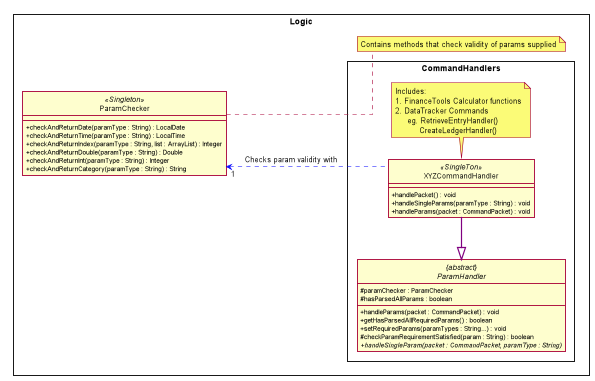
#### 2.1.2.1 ParamChecker
1. Contains a set of public static methods which are used to verify the correctness of `param` in the 
```CommandPacket``` instance.
1. If there is nothing wrong with the ```param```, the method will typically return the `param` supplied without modification.
1. If the ```param``` fails to pass the tests administered within the method, the following procedures will execute:
    1. Log to log file a corresponding error message with ```WARNING``` level
    1. Print to console, any applicable error messages.
    1. Throw a common exception: `ParseFailParamException` 
        1. The implication is that the range of exceptions that would have been caught in other
        parts of the software with regards to param handling, is now consolidated within a single class in the program.
        The class that uses ParamChecker is only concerned with whether the ```param``` is valid or not.
1. Example:
    * The following method checks validity of dates supplied from user input.
    * It is used by `createLedgerCommand` class. 

```
    public LocalDate checkAndReturnDate(String paramType)
        throws ParseFailParamException {
        LocalDate date = null;
        boolean parseSuccess = false;

        clearErrorMessage();

        LoggerCentre.loggerParamChecker.info("Checking date...");
        try {
            String rawDate = packet.getParam(paramType);
            if (rawDate.trim().length() == 0) {
                throw new EmptyParamException(paramType);
            }
            date = DateTimeParser.parseLocalDate(rawDate);
            parseSuccess = true;
        } catch (DateTimeException exception) {
            LoggerCentre.loggerParamChecker.warning(
                String.format("Date parsed but not valid... Err: %s", exception.getMessage()));

            errorMessage = getErrorMessageDateDateTimeException();
        } catch (InvalidParameterException exception) {
            LoggerCentre.loggerParamChecker.warning(
                String.format("Date input cannot be parsed... Err: %s", exception.getMessage()));

            errorMessage = getErrorMessageDateInvalidFormat();
        } catch (EmptyParamException exception) {
            LoggerCentre.loggerParamChecker.warning(
                String.format("No date input supplied... Err: %s", exception.getMessage()));

            errorMessage = UiManager.getStringPrintWithStatusIcon(Common.PrintType.ERROR_MESSAGE,
                exception.getMessage(),
                "Enter \"commands\" to check format!");
        } finally {
            printErrorMessage();
        }
        if (!parseSuccess) {
            throw new ParseFailParamException(paramType);
        }
        return date;
    }
```

#### 2.1.2.2 ParamHandler
1. After parsing from user input to produce a ```commandPacket``` instance, the instance needs to be handled by a particular ```ParamHandler``` children class,
which processes the ```commandPacket``` attributes to perform a specific function. 

1. Handling of params via```handleParams(packet)```:
    1. Initialize the state of the handler 
        1. Children class of ```ParamHandler``` call ```setRequiredParams()``` to set required Params that need to be parsed successfully to constitute an overall successful parse.
        1. Resetting String arrays in the following ```param``` arrays:
            * ```missingRequiredParams```
            * ```paramsSuccessfullyParsed```
        1. Set the ```CommandPacket``` instance in ```ParamChecker``` by calling ```ParamChecker.setPacket(packet)```.
    1. Call `handleParams()`
        1. For every```paramType``` in the ```CommandPacket``` instance, execute ```handleSingleParam(packet)``` method. 
        1. ```handleSingleParam(packet)``` is an abstract method, and it is implemented by children classes of ```ParamHandler``` depending on the needs and requirements of that particular class.
        1. If the `param` fail to be parsed due to input error, an exception from `ParamChecker`: `ParseFailParamsException` will be caught.
        The error message from `ParamChecker` will be printed.
        1. Else if the `param` parses successfully, it will be added to ```paramsSuccessfullyParsed```
    1. Check if the parse was successful. The condition below that define a successful parse is:
        1. All ```param``` in ```createLedgerCommand.requiredParams``` string array are parsed with no exceptions thrown.
        That is, all `param` in ```createLedgerCommand.requiredParams``` is also in ```paramsSuccessfullyParsed```.
    1. If parse is successful, the process ends gracefully. Else, throw ```InsufficientParamsException()```.

#### 2.1.2.3 CommandHandler
1. Extends `ParamHandler` class. Implements ```handleSingleParams()``` fully, depending on the interactions
between the operation and the `param` that it accepts. 
1. Typically used within Logic Managers to handle processing of `CommandPacket` instances to decide sub-operations
to perform to achieve full operation specified by the user. 
1. Example:`handleDeleteLedger()`
    1. Uses `retrieveLedgerCommand` to interpret the `ledger` instance to deleted, as specified by the user
    1. Retrieves the `ledger` instance and performs delete within the method.   


### 2.1.3 Input Manager Component


### 2.1.4 Model Component
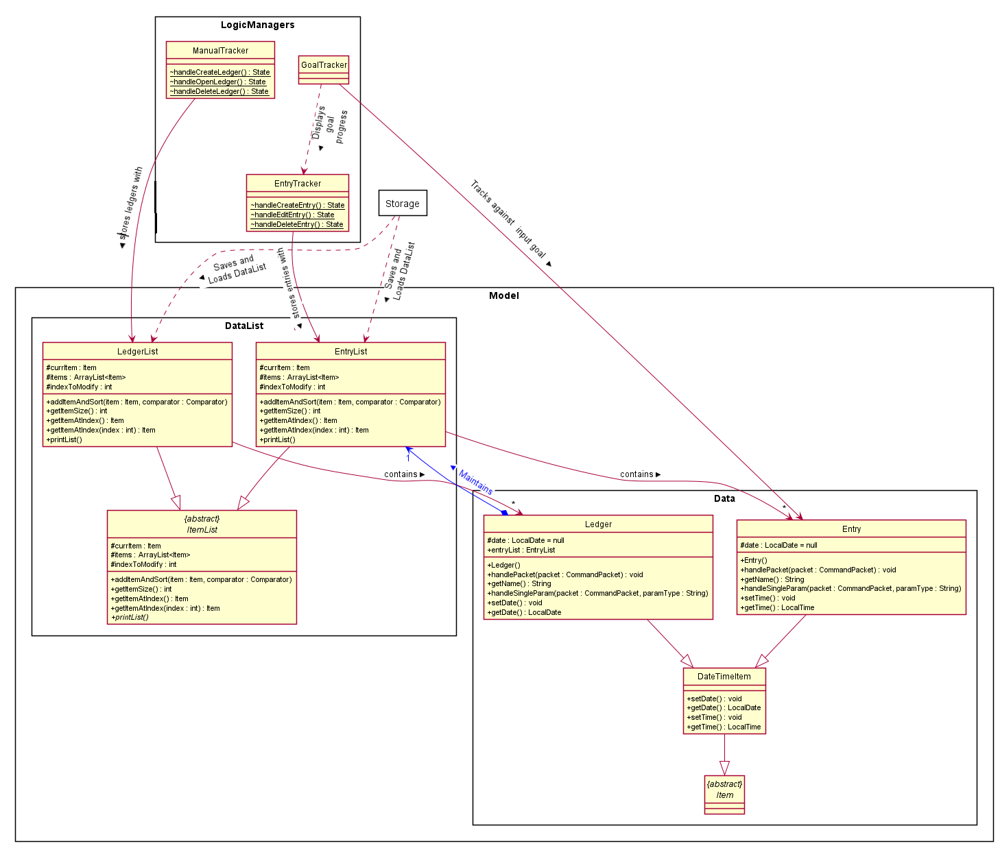

### 2.1.5 Storage Component
(FILL ME)

## 2.2 Feature-level implementation
### 2.2.1 Main Menu
- Loading up user data
- Access to various features
- Saving outstanding user data to respective save files

### 2.2.2 Feature 1: Manual Tracker & Entry Tracker
#### 2.2.2.1 Overview
__Ledgers and Entries__

In this feature, we represent the transactions incurred by the users as ```Entry``` instances.
Instances of ```Entry``` class are categorised by the date of origin, which is represented by
```Ledger``` instances.

```Entry``` instances are characterized by the following: 
* Time of transaction
* Type of transaction: Income/ Expense 
* Amount in transaction
* Category of spending/ expenditure
* Description

```Ledger``` instances are characterized by the following: 
* Time of transaction
* Collection of ```Entry```instances

#### 2.2.2.2 Manual Tracker

The Manual Tracker is a feature that allows users to manage Ledgers with create, delete
and open operations. Ledgers is a class that maintains a list of transactions that are 
recorded for a given date. 

The Entry Tracker is fundamentally similar to the Manual Tracker, except it manages ```Entry``` instances
instead of ```Ledger```. Entry Tracker is initialized when a ```Ledger``` instance is "opened", whereby 
the Entry Tracker facilitate the manipulation of the collection of ```Entry``` instances that are associated with
that particular ```Ledger``` instance.

For the sake of brevity, this section will focus on the discussion of the Manual Tracker. Section [2.2.2.3] (#2.2.2.3) will describe
the edit operation of the Entry Tracker, which is sufficiently unique to Manual Tracker operations to merit detailed discussion.

The Manual Tracker is capable of executing the following states of operation:

|States| Operations | 
|--------|----------|
|```MAIN_MENU```|Go to main menu for users to choose the available operations
|```CREATE_LEDGER```|Create a ledger specified by date, and append it to ```ledgerList```.
|```DELETE_LEDGER```|Delete an existing ledger, referenced by date or index.
|```OPEN_LEDGER```|Go to subroutine "Entry Tracker" for the entries recorded  under the specified ledger.

#### 2.2.2.3 Architecture in context

#### 2.2.2.4 Logic Manager and Parser


|Class| Function |
|--------|----------|
|```InputParser```| Breaks input string by user into ```commandString``` and a sequence of ```paramTypes```-```param``` pairs. <br><br> The latter subsequence of the string is passed into ParamParser for further processing. <br><br> Information obtained from input parsing will be used to populate an instantiated ```CommandPacket``` instance, which will then be passed to the entity that called the parsing function.
|```ParamParser```| Process the sequence of ```paramTypes```-```param``` pairs and populate the ```paramMap``` in the instantiated ```CommandPacket``` instance.
|```ManualTracker```| [Refer to section above](#handlerAndCommand).
|```EntryTracker```| Omitted for brevity.

#### 2.2.2.5 Logic Manager and Data


|Class| Function |
|--------|--------|
|```ManualTracker```| [Refer to section above](#handlerAndCommand).
|```EntryTracker```| Omitted for brevity.
|```EntryList```| Omitted for brevity.
|```Entry```| Omitted for brevity.
|```LedgerList```| Extends ItemList. Refer to Ledgers and Entries section for class behavior.
|```Ledger```| Extends DateTimeItem. Refer to Ledgers and Entries section for class behavior.
|```ItemList```| Class with defined list behavior specified with helper methods such as retrieval, checking of Duplicates and deletion.
|```DateTimeItem```| Abstract class that extends ```Item``` class; instances will have ```LocalDate``` or ```LocalTime``` attributes and corresponding helper methods.
|```Item```| Abstract class to define behavior of entities that need are stored in ```ItemList``` instances.


#### 2.2.2.6 Functions with Sequence Diagrams

##### 2.2.2.6.1 Creation of Ledger
1. At ```ManualTracker.handleMainMenu()```, the user's input is registered via ```java.util.Scanner``` instance.
1. Input is parsed by ```InputParser.parseInput()```, and ```ManualTracker.packet``` is set to the returned ```CommandPacket``` instance.
1. The ```commandString``` of the ```CommandPacket``` instance is evaluated, and the corresponding handle method() is executed.<br>
In this case, ```handleCreateLedger()``` will be called.
1. At ```handleCreateLedger()```, the following processes will be executed:
    1. A new instance of ```createLedgerCommand``` is created. The input String array will be passed into 
    ```createLedgerCommand.setRequiredParams()``` to set required params for a successful parse.
    1. A new instance of ```Ledger``` will be instantiated and set to ```createLedgerCommand.currLedger```.
    1. ```createLedgerCommand.handlePacket(packet)``` is called to handle params in the packet.
        1. Refer to the [section on Param Handling](#paramHandling) for more details pertaining to general param handling. 
        1. For ```createLedgerCommand```, the ```handleSingleParam``` abstract method will be implemented as follows:
        
            |ParamType|ParamType String| Expected Param | Operation | Verification method |
            |---------|----------------|----------------|-----------|---------------------|
            |```PARAM.DATE```|"/date"|Various format of date in string, eg. "2020-03-02"| Call ```currLedger.setDate()``` to set date for the ```Ledger``` instance. | ```ParamChecker.checkAndReturnDate(packet)```|
1. From ```ManualTracker```, the configured ```Ledger``` instance will be retrieved from the ```createLedgerCommand``` instance
and added into the ```LedgerList``` instance at ```ManualTracker.ledgerList```.
  
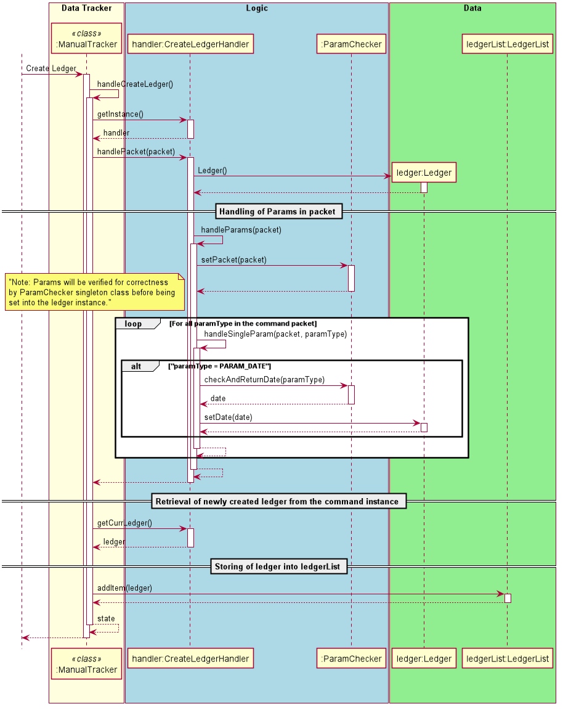


##### 2.2.2.6.1 Deletion of Ledger
The deletion of a specified ledger is performed in two phases: Ledger Retrieval and Ledger Delete.
1. __Phase 0: Instruction retrieval__ 
    1. At ```ManualTracker.handleMainMenu()```, the user's input is registered via ```java.util.Scanner``` instance.
    1. Input is parsed by ```InputParser.parseInput()```, and ```ManualTracker.packet``` is set to the returned ```CommandPacket``` instance.
    1. The ```commandString``` of the ```CommandPacket``` instance is evaluated, and the corresponding handle method() is executed.<br>
    In this case, ```handleDeleteLedger()``` will be called.
1. __Phase 1: Ledger retrieval__
    1. At ```handleDeleteLedger()```, the following processes will be executed:
        1. A new instance of ```retrieveLedgerCommand``` is created. The input String array will be passed into 
        ```createLedgerCommand.setRequiredParams()``` to set required params for a successful parse.
        1. ```deleteLedgerCommand.handlePacket(packet)``` is called to handle params in the packet.
            1. Refer to the section on [Param Handling](#paramHandling) for more details pertaining to general param handling. 
            1. For ```createLedgerCommand```, the ```handleSingleParam``` abstract method will be implemented as follows:
                * Note that only one of the two params need to be invoked from the input. 
            
        |ParamType|ParamType String| Expected Param | Operation | Verification method |
                |---------|----------------|----------------|-----------|---------------------|
                |```PARAM.DATE```|"/date"|Various format of date in string, eg. "2020-03-02"| Call ```ledgerList.setIndexToModify()``` to set index of retrieved item. | ```ParamChecker.checkAndReturnDate(packet)```|
                |```PARAM.INDEX```|"/index"|Valid index on the list from 1 onwards.|Call ```ledgerList.setIndexToModify()``` to set index of retrieved item. | ```ParamChecker.checkAndReturnIndex(packet)```|

1. __Phase 2: Ledger Deletion__
    1. From ```ManualTracker```, call ```ledgerList.RemoveItemAtCurrIndex()``` to remove the ledger specified by the index set to modify earlier.


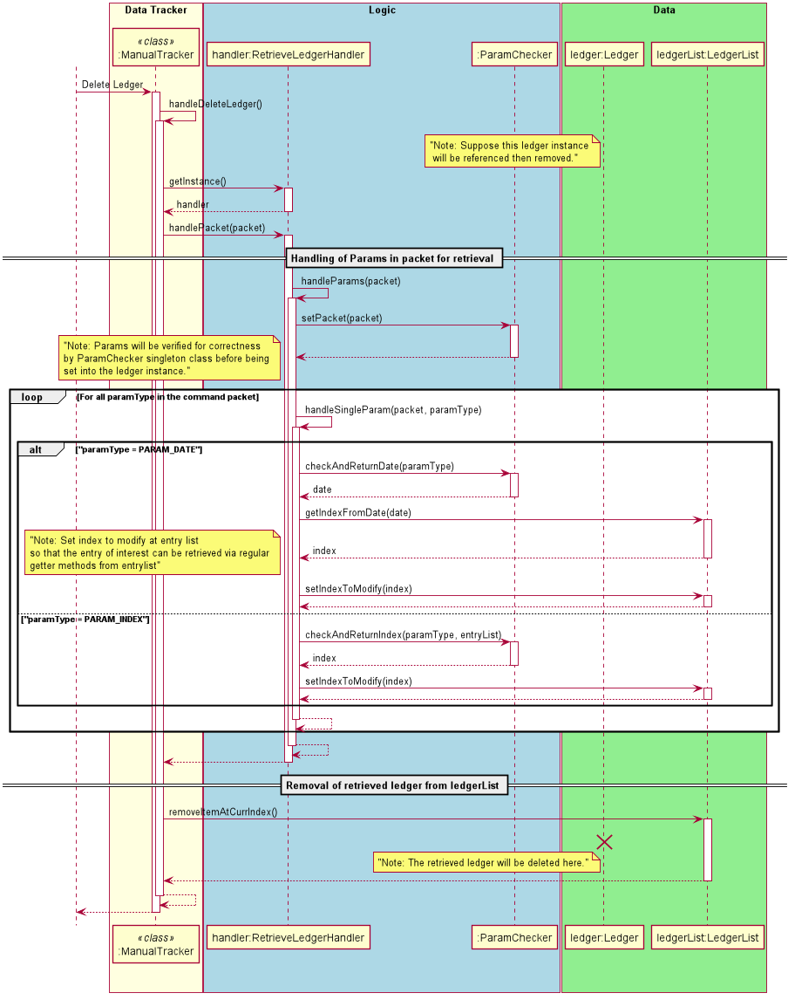

#### 2.2.2.7 Entry Tracker: Edit of entries
The editing of details within the entry is performed in two phases: Entry Retrieval and Entry Edit.
1. __Phase 0: Instruction retrieval__ 
    1. At ```EntryTracker.handleMainMenu()```, the user's input is registered via ```java.util.Scanner``` instance.
    1. Input is parsed by ```InputParser.parseInput()```, and ```ManualTracker.packet``` is set to the returned ```CommandPacket``` instance.
    1. The ```commandString``` of the ```CommandPacket``` instance is evaluated, and the corresponding handle method() is executed.<br>
    In this case, ```handleEditEntry()``` will be called.
1. __Phase 1: Entry retrieval__
    1. At ```handleEditEntry()```, the following processes will be executed:
        1. A new instance of ```retrieveEntryCommand``` is created. The input String array will be passed into 
        ```retrieveEntryCommand.setRequiredParams()``` to set required params for a successful parse.
        1. ```retrieveEntryCommand.handlePacket(packet)``` is called to handle params in the packet.
            1. Refer to the section on [Param Handling](#paramHandling) for more details pertaining to general param handling. 
            1. For ```retrieveEntryCommand```, the ```handleSingleParam``` abstract method will be implemented as follows:
            
        |ParamType|ParamType String| Expected Param | Operation | Verification method |
                |---------|----------------|----------------|-----------|---------------------|
                |```PARAM.INDEX```|"/index"|Valid index on the list from 1 onwards.|Call ```entryList.setIndexToModify()``` to set index of retrieved item. | ```ParamChecker.checkAndReturnIndex(packet)```|
        
        1. From ```EntryTracker```, call ```entryList.getItemAtCurrIndex``` to retrieve the entry specified by the index set to modify earlier.

1. __Phase 2: Entry edit__
    1. Following Phase 1, the following processes will be executed:
        1. A new instance of ```editEntryCommand``` is created. There is no need to call ```editEntryCommand.setRequiredParams()```
        ; this command does not require params to modify. Instead, it acceps any params supplied and performs the edit accordingly.
        1. ```editEntryCommand.handlePacket(packet)``` is called to handle params in the packet.
    1. ```editEntryCommand.handlePacket(packet)``` is called to handle params in the packet.
            1. Refer to the section on [Param Handling](#paramHandling) for more details pertaining to general param handling. 
            1. For ```editEntryCommand```, the ```handleSingleParam``` abstract method will be implemented as follows:
            
        |ParamType|ParamType String| Expected Param | Operation | Verification method |
                |---------|----------------|----------------|-----------|---------------------|
                |```PARAM.AMOUNT```|"/amt"|Double in 2 decimal places|Call ```entryList.setAmount()``` to set amount | ```ParamChecker.checkAndReturnDoubleSigned(packet)```|
                |```PARAM.TIME```|"/time"|Various format of time in string, eg. "15:00"|Call ```entryList.setTime()``` to set index of retrieved item. | ```ParamChecker.checkAndReturnTime(packet)```|
                |```PARAM.INC```|"-i"|Income entry type flag|Call ```entryList.setEntryType(EntryType.INC)``` to set index of retrieved item. | ```nil```|
                |```PARAM.EXP```|"-e"|Expense entry type flag|Call ```entryList.setEntryType(EntryType.EXP)``` to set index of retrieved item. | ```nil```|
                |```PARAM.DESCRIPTION```|"/desc"|Description in string, ';' character is illegal.|Call ```entryList.setDescription()``` to set index of retrieved item. | ```ParamChecker.checkAndReturnDescription(packet)```|
                |```PARAM.CATEGORY```|"/cat"|A set of strings that corresponds with entry type|Call ```entryList.setCategory()``` to set index of retrieved item. | ```ParamChecker.checkAndReturnCategories(packet)```|
            
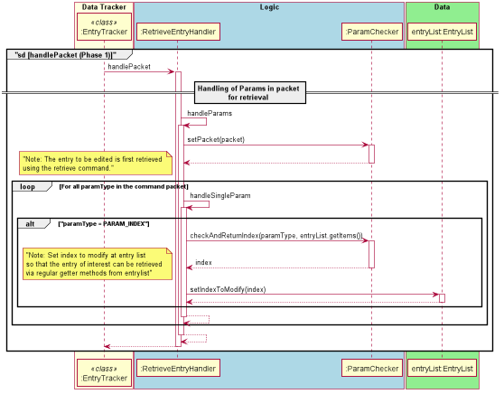


### 2.2.3 Feature 2: Recurring Tracker
##### Overview
##### Recurring Tracker
Recurring Tracker handles the creation, deletion and editing of recurring entries.

Entries use the class ```RecurringEntry```, and are stored in the ```RecurringEntryList``` class.

`RecurringEntry` has the following attributes:
* `day` - The day which the transaction occurs
* `description`
* `entryType` - Can be `Constants.EntryType.INC` or `Constants.EntryType.INC` 
depending on whether the entry is an income or expenditure respectively.
* `amount`
* `start` and `end` - Which months does the entry apply to. Set to 1 and 12 by 
default (i.e. occurs every month)
* `isAuto` - Indicates whether the entry is automatically deducted/credited from/to account, 
or manually deducted/credited from/to account
* `notes` - Any user-specified notes

`RecurringTrackerList` extends ItemList, and supports the following methods on top of inherited methods
* `addItem(Item)` - Override. Adds item and sorts according to the day in ascending order
* `getEntriesFromDayXtoY` - Returns an ArrayList of all entries that fall between day X and Y 
(provided by developer in the code, not by user). Mainly used for reminders

##### Reminders
Upon launching the program, the system date and time is recorded in `RunHistory`.

The program then checks if there are any entries upcoming within 5 days from the current date, and prints the entries out
as reminders.

1. Main code calls `MenuPrinter#printReminders()`, which in turn calls 
`ReminderListGenerator#generateListOfRemindersAsStrings()`. 
1. `ReminderListGenerator` checks the current date, and calculates the day of month which is 5 days from current date.
This is stored in `dayToRemindUntil`.
1. `ReminderListGenerator` then checks if `dayToRemindUntil` is after the last day of the current month. If it is,
then the reminder timeframe will overflow to the next month. 
    
    For example:
    * Current date is 29th October. There are 31 days in October. 5 days after today is 34th, 
    which is beyond last day of October.
    * Reminder timeframe will overflow to next month, until 3rd of November

1. If it has overflown, set `isOverflowToNextMonth` to true. Subtract the last day of month from `dayToRemindUntil`.
The new value of `dayToRemindUntil` is the day of next month that the reminder timeframe extends to.

    For example:
    * Continuing from example earlier, `dayToRemindUntil = 34`.
    * `dayToRemindUntil -= NUM_DAYS_IN_OCT`, i.e. 34 - 31
    * `dayToRemindUntil = 3`, representing that the reminder timeframe extends to 3rd of November
1. `ReminderListGenerator` then grabs the entries within the reminder timeframe from the list of all recurring entries.
    * If `isOverflowToNextMonth == true`, it will grab all entries from `currentDay` to `lastDayOfMonth` 
    and all entries from `1` (1st day of next month) to `dayToRemindUntil`
    * Else, it will simply grab all entries from `currentDay` to `dayToRemindUntil`

1. Lastly, the list of entries will be converted to a formatted String to be displayed as reminders, and passed back
to `MenuPrinter`, who will pass it to `UiManager` to print.

The sequence diagram below shows how it works:

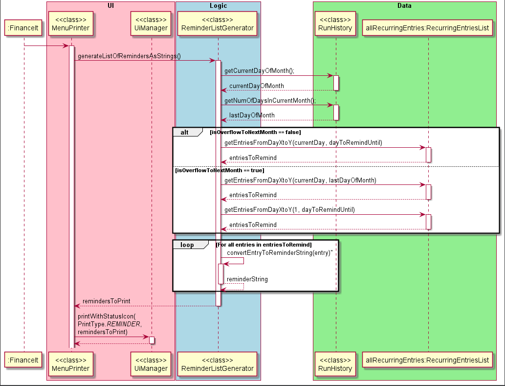

#### 2.2.4 Feature 3: FinanceTools
##### Overview
FinanceTools consists of the following features
1. Simple Interest Calculator
2. Yearly/Monthly Compound Interest Calculator
3. Cashback Calculator
4. Miles Credit Calculator
6. Account Storage
7. Command and Calculation History

##### Simple Interest Calculator
Simple Interest Calculator is facilitated by ```SimpleInterest``` class. It allows user to calculate interest earned.
When user inputs ```simple``` as a command, ```handleSimpleInterest``` from ```Handler``` class will handle user
inputted parameters. The calculation is done by ```SimpleInterest``` class. The result is outputted in
```FinanceTools.main()```.
<br />

##### Parameters
* ```/a``` - Amount (Mandatory)
* ```/r``` - Interest Rate (Mandatory)

The following class diagram shows how the Simple Interest Calculator feature works:
<br />


The following sequence diagram shows how the params are handled before the implementation is carried out:
<br />
.png)
<br />
<br />
The following sequence diagram shows how the Simple Interest Calculator feature works:
<br />
.png)

##### Yearly/Monthly Compound Interest Calculator
Yearly/Monthly Compound Interest Calculator is facilitated by ```YearlyCompoundInterest``` /
```MonthlyCompoundInterest``` class. It allows user to calculate interest earned.
When user inputs ```cyearly``` / ```cmonthly``` as a command, ```handleYearlyCompoundInterest``` /
```handleMonthlyCompoundInterest``` from ```Handler``` class will handle user inputted parameters. The calculation 
is done by ```YearlyCompoundInterest``` / ```MonthlyCompoundInterest``` class. The result is outputted in
```FinanceTools.main()```.
<br />

##### Parameters (Yearly/Monthly Compound Interest Calculator)

* ```/a``` - Amount (Mandatory)
* ```/r``` - Interest Rate (Mandatory)
* ```/p``` - Number of Years/Months (Mandatory)
* ```/d``` - Yearly/Monthly Deposit (Optional)

The following class diagram shows how the Yearly/Monthly Compound Interest Calculator feature works:
<br />
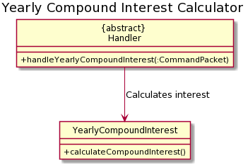
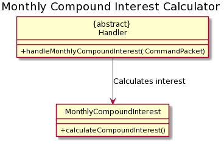
<br />
The following sequence diagram shows how the params are handled before the implementation is carried out:
<br />
.png)
<br />
<br />
.png)
<br />
<br />
The following sequence diagram shows how the Yearly/Monthly Compound Interest Calculator feature works:
<br />
.png)
<br />
<br />
.png)

##### Cashback Calculator
Cashback Calculator is facilitated by ```Cashback``` class. It allows user to calculate cashback earned.
When user inputs ```cashb``` as a command, ```handleCashback``` from ```Handler``` class will handle user
inputted parameters. The calculation is done by ```Cashback``` class. The result is outputted in
```FinanceTools.main()```.
<br />

##### Parameters 
* ```/a``` - Amount (Mandatory)
* ```/r``` - Cashback Rate (Mandatory)
* ```/c``` - Cashback Cap (Mandatory)

The following class diagram shows how the Cashback Calculator feature works:
<br />
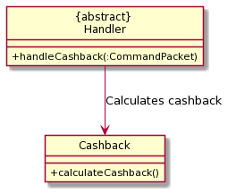

The following sequence diagram shows how the params are handled before the implementation is carried out:
<br />
.png)
<br />
<br />
The following sequence diagram shows how the Cashback Calculator feature works:
<br />
.png)

##### Miles Credit Calculator
Miles Credit Calculator is facilitated by ```MilesCredit``` class. It allows user to calculate miles credit earned.
When user inputs ```miles``` as a command, ```handleMilesCredit``` from ```Handler``` class will handle user
inputted parameters. The calculation is done by ```MilesCredit``` class. The result is outputted in
```FinanceTools.main()```.
<br />

##### Parameters
* ```/a``` - Amount (Mandatory)
* ```/r``` - Miles Rate (Mandatory)

The following class diagram shows how the Miles Credit Calculator feature works:
<br />


The following sequence diagram shows how the params are handled before the implementation is carried out:
<br />
.png)
<br />
<br />
The following sequence diagram shows how the Miles Creidt Calculator feature works:
<br />
.png)

##### Account Storage 
Account Storage feature is facilitated by ```AccountStorage``` class. It allows user to store account
information such as name of account, interest rate, cashback rate, etc. When user inputs ```store``` as command,
```handleAccountStorage``` from ```Handler``` class will handle user inputted parameters and store information 
accordingly. The implementation is done by ```handleInfoStorage``` from ```AccountStorage``` class. Afterwards, this 
information is stored into a txt file which is done by ```updateFile``` from ```AccountSaver``` class.
<br />

Additionally, it implements the following operations:
* ```info``` - list account(s) information
* ```clearinfo``` - clear all information
* ```store /rm <ACCOUNT_NO>``` - delete corresponding account number in list

##### Parameters
* ```/n``` - Account Name (Optional)
* ```/ir``` - Interest Rate (Optional)
* ```/r``` - Cashback Rate (Optional)
* ```/c``` - Cashback Cap (Optional)
* ```/o``` - Other Notes (Optional)
* ```/rm``` - Account Number (Optional)

##### Details
```handleInfoStorage``` stores the user inputted information into an ```ArrayList``` which is then passed into
```updateFile``` to update the txt file. The purpose of using txt file is so that when the user exits and enters the
program again, the information is retained, and the user does not have to re-enter the account information(s) again.
<br />
 
When user first enters FinanceTools in the program, ```readFileContents``` reads 5 lines in the txt file consecutively
in a ```while``` loop because these 5 lines consists of information that belong to a particular account. These
categories include: Name, Interest Rate, Cashback Rate, Cashback Cap and Notes". Doing so helps to facilitate
the ```delete``` option where instead of deleting single lines, we can delete the entire account information
which correspond to a particular account because the information is stored in one index of the ```ArrayList```.
<br />
 
The following class diagram shows how the Account Storage feature works:
<br />


The following sequence diagram shows how the params are handled before the implementation is carried out:
<br />

.png)
<br />
<br />
The following sequence diagram shows how the Account Storage feature works:
<br />

.png)
<br />
<br />

.png)
 
#### Command and Calculation History
To store the commands inputted by user and results from calculations in FinanceTools, an ```ArrayList``` is used.
The commands are stored in the ```ArrayList``` before the params are handled and implementation is executed. 
The results from calculation is stored in the ```ArrayList``` when the implementation has finished executed.

#### 2.2.5 Feature 4: Goal Tracker
##### Set Expense Goal Feature
The set expense goal feature is being implemented by ```GoalTracker```. It allows the user to set an expense goal for
the respective month to ensure that the user does not overspent his budget. 
When user enter ```expense 2000 for 08```, the command will be sent to InputParser and parse it into String[].
With the String[], it will be sent to a class called ```Goal```, and it will store the individual information.
Afterwards, it will be added to a ArrayList in a class called ```TotalGoalList```. 
 
Not only that, ```GoalTracker``` also implemented a feature called ```set income goal``` that works almost the same as 
set expense goal feature with just slight command difference.
 
 `Format:`
* setExpenseGoal: expense 5000 for 08
* setIncomeGoal: income 5000 for 08
 
##### How it works?
Firstly, user will input the command based on the `Format`.
Secondly, the input command will be sent to InputParser to parse.
Thirdly, the parsed information will be sent to class `Goal` to store the individual information
Next, it will be added to a ArrayList in class `TotalGoalList`.
Lastly, the goal status will be displayed to the user.  
 
This class diagram will show how the setting of expense goal works:
<br />

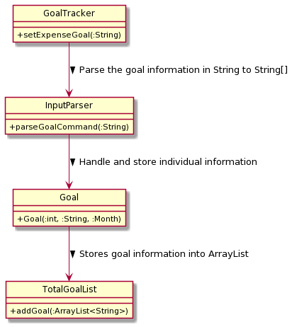
 
This sequence diagram will show the flow of setting of expense goal:
<br />


### 2.2.6 Feature 5: Save Manager Utility
#### What it does
Save Manager utility is a tool designed for backup and storage of all data associated with Goal tracker, Manual tracker and recurring tracker.
It allows multiple saves to be created and loaded at will.

#### Overview
Save Manager utility contains 5 classes. SaveHandler class contains some commonly used functions such as buildFile that is inherited to the 3
saver child classes. goalTrackerSaver produce text file to save goalTracker states, autoTrackerSaver saves recurringTracker states and
manualTrackerSaver saves manualTracker states. SaveManager class is the UI class that uses the 3 saver classes to do load and save operations.

#### Save Manager Class Diagram

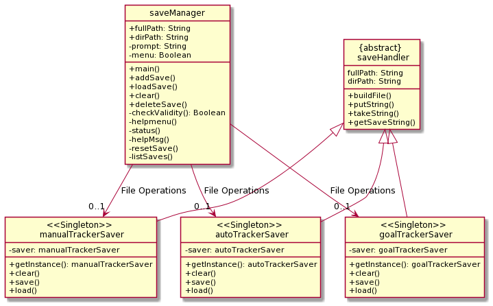

#### Save Manager Sequence Diagram

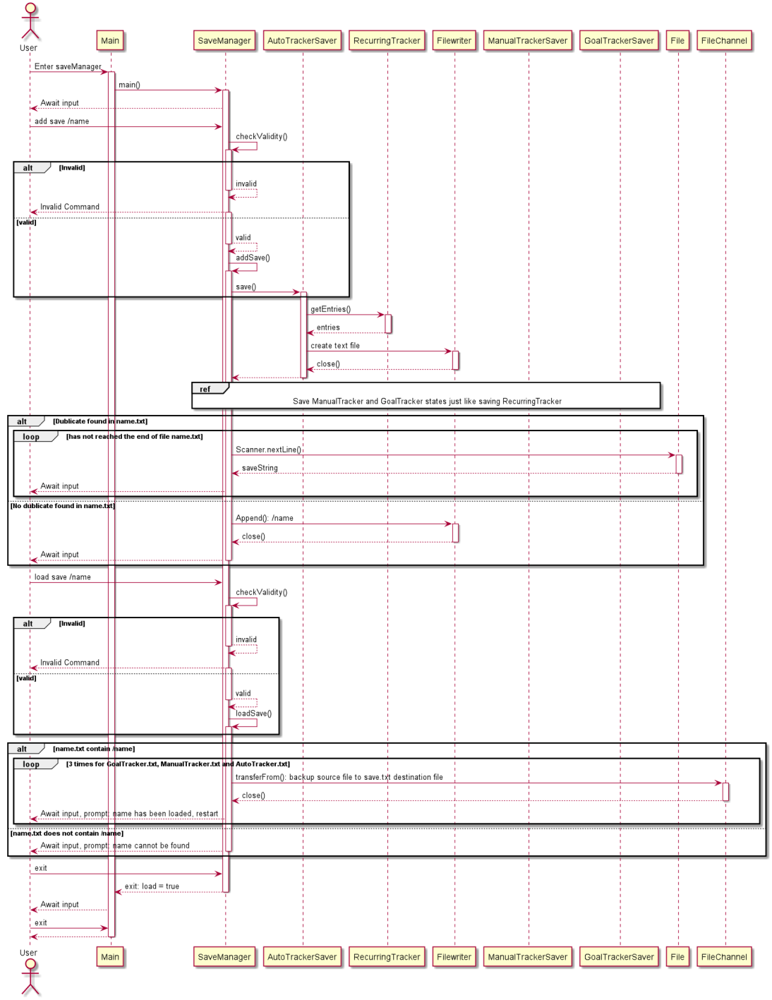

## 3. Product scope
### Target user profile

Fresh computing graduates who are just starting to enter the workforce.
* Have limited income/budget
* Little experience in personal financial management
* Busy juggling their various job applications and interview which might cause them to lose track of their expenditure/ 
bill payments
* First time drawing salary and lack experience in income tax filling

### Value proposition
 
**Expenditure Tracker**
* Input itemised spending on a daily basis
* Sum the monthly/weekly expenditure, as well as average weekly/daily expenditure
* Categorise expenditures (e.g. food, transport etc) and sort by category

**Budget Management**
* Set a budget (monthly)
* Remind users of how much budget they have left for that month
* Edit the budget (monthly)
* Display the budget for that month

**Bill Tracker**
* Remind users of payment due dates
* Monthly tracker for each individual bill, visualise trends in bill spending

**Finance Tools**
* Calculate simple interest
* Calculate compound interest with optional monthly/yearly deposit
* Calculate cashback earned
* Calculate miles credit earned
* Save account information for reference

## 4. User Stories

|Version| As a ... | I want to ... | So that I can ...|
|--------|----------|---------------|------------------|
|v1.0|user|calculate interest over a principal amount|know how much interest I can earn|
|v1.0|user|calculate interest earned over a period time|know how much interest I can earn at the end of a period|
|v1.0|user|calculate cashback earned|know how much cashback I can earn|
|v1.0|user|calculate miles credit earned|know how much miles credit I can earn|
|v2.0|user|calculate interest over a principal amount with yearly or monthly deposit|know how much interest I can earn with regular deposits|
|v2.0|user|store account or card information|refer to account features such as interest rate any time|
|v2.0|user|compare my calculations with different interest rate|decide which account is better|

## 5. Non-Functional Requirements

* _Constraint_ - Single User Product
* _Performance_ - JAR file does not exceed 100Mb
* _User_ - Users should prefer typing on CLI
* _Program_ - Platform independent (Windows/Mac/Linux)
* _Program_ - Works without needing an installer

## 6. Glossary

* _IntelliJ_ - An Integrated Development Environment (IDE) used to develop FinanceIt.
* _CLI_ - Command Line Interface
* _UML_ - Unified Modeling Language

## 7. Instructions for Manual Testing

1. Download the executable from our [latest release](https://github.com/AY2021S1-CS2113-T16-1/tp/releases/) .
1. Save the executable file in your preferred folder.
1. Run the program via the command line. The command is: ```java -jar financeit.jar```.
1. You should see the following output:


### 7.1 Testing Main Menu
1. Accessing a feature:
    1. ```ManualTracker```
        1. Enter ```manual``` into the console.
            You should see the following: 
            
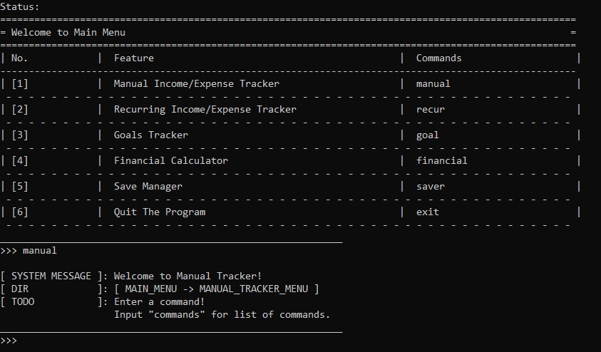

    1. ```RecurringTracker```
    1. ```GoalTracker```
    1. ```SaveManager```
    1. ```FinanceTools```

1. Exiting the main menu and quit the program: 
    1. Enter ```exit``` into the console.
        You should see the following: 
        
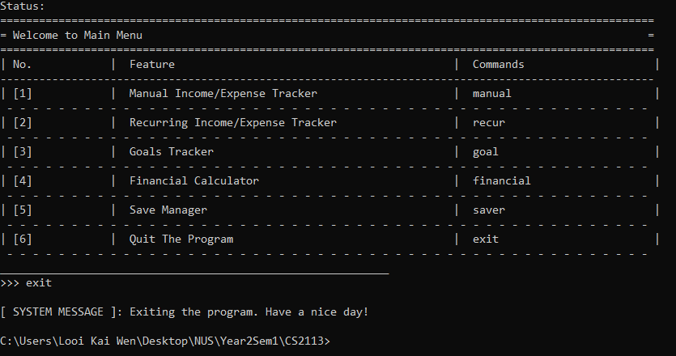

###<a name = 7.2></a> 7.2 Testing ManualTracker
#### 7.2.1 Testing Show Command List
1. Enter ```commands``` into the console.
You should see the following: 


####<a name = 7.2.2></a> 7.2.2 Testing Create Ledger
##### Positive test
1. Enter ```new /date 200505``` into the console.
You should see the following:


##### Negative test: Duplicate inputs
1. Again, enter ```new /date 200505``` into the console.
You should see the following:


#### 7.2.3 Testing Show Ledger List
##### Positive test
1. Enter ```list``` into the console. 
You should see the following: 

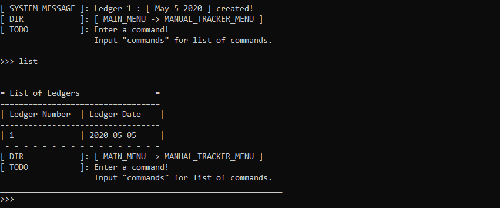

    * Observe that there is currently one ledger in the list, of date 2020-05-05.
1. Refer to [7.2.1](#7.2.1) to create another ledger of date 2020-06-06 using the command: 
```new /date 200606```. 
1. Enter ```list``` into the console. 
    * Observe that there are now two ledgers in the list.
You should see the following: 


#### 7.2.4 Testing Delete Ledger
##### Positive test
1. Enter ```delete /id 1``` into the console.
    * This will delete the first ledger on index, which is of date 2020-05-05
1. Enter ```list``` into the consolde.
You should see the following:


    * Observe there is now one ledger on the list.

#### 7.2.5 Testing Open Ledger
1. Enter ```open /date 200707``` into the console.
You should see the following:

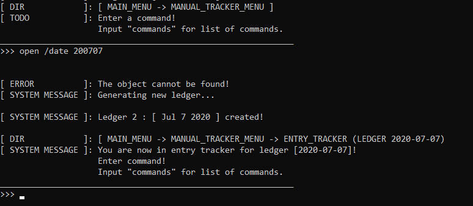

    * Note that the ledger of date 2020-07-07 was not created beforehand. 
    However, the ledger will be automatically created by the operation, and
    will resume as per normal. 

### 7.3 Testing EntryTracker
1. The following testing guide assumes that testing at [7.2](#7.2) is completed.
#### 7.3.1 Testing Show Command List
1. Enter ```commands``` into the console.
You should see the following:


#### 7.3.2 Testing Show Category List
1. Enter ```cat``` into the console.
You should see the following:


#### 7.3.2 Testing Create Entry
1. Enter ```new /time 1500 /cat tpt /amt $16.30 /desc Riding the bus back home -e``` into the console.
You should see the following:


1. Enter ```new /time 1500 /cat slr /amt $16.30 /desc Riding the bus back home -i``` into the console.
You should see the following:


1. Enter ```new /time 1500 /cat tpt /amt $16.30 /desc Riding the bus back home -i``` into the console.
You should see the following:


    * Note that the error is thrown because category ```tpt``` is not considered an income, `-i`. Instead, it is 
    considered an expenditure, and `-e` should have been used instead.

#### 7.3.3 Testing Show Entry List
1. Enter ```list``` into the console.
You should see the following:


    * Note that the number of entries is now __2__.

#### 7.3.4 Testing Edit Entry

1. Enter ```edit /id 1 /amt $0.50``` into the console.
1. Enter ```list``` into the console.
You should see the following:


* Observe that the entry of entry number 1 is not $0.50 under the __Amount__ column.

#### 7.3.5 Testing Delete Entry 
1. Enter ```delete /id 2``` into the console.
1. Enter ```list``` into the console.
You should see the following:


* Observe the entry that is the latter to be added, entry with __Entry Type = Income__, is now
removed from the list.

### 7.4 Testing RecurringTracker


### 7.5 GoalTracker

### 7.6 Testing SaveManager

### 7.7 Testing FinanceTools

    
